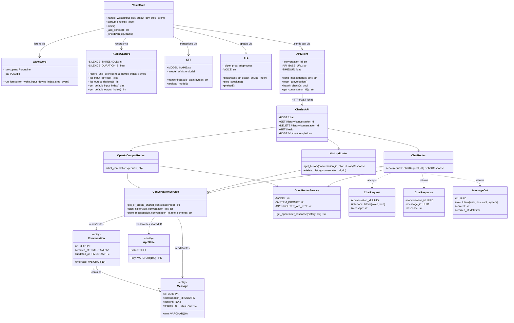
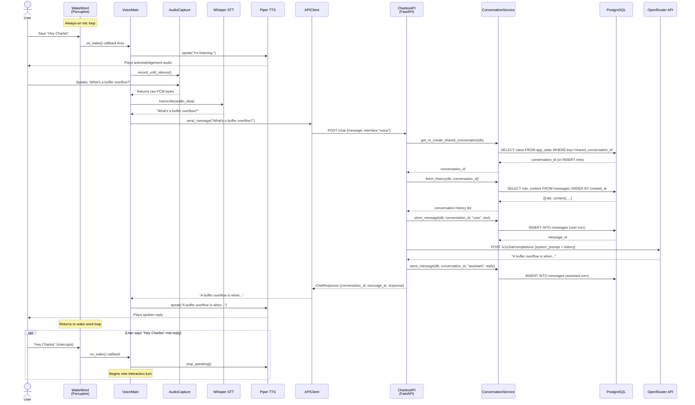

# Charles — System Diagrams

> Generated 2026-03-31. Reflects Phase 1 (backend) + Phase 3 (voice service) implementation.

---

## 1. Use Case Diagram

```
┌─────────────────────────────────────────────────────────────────┐
│                         Charles System                          │
│                                                                 │
│   ┌──────────────────────────────────┐                          │
│   │         Voice Interface          │                          │
│   │                                  │                          │
│   │  ○ Activate with "Hey Charles"   │◄────────────────── 《User》
│   │  ○ Ask a question (voice)        │◄────────────────── 《User》
│   │  ○ Receive spoken reply          │◄────────────────── 《User》
│   │  ○ Interrupt / stop TTS          │◄────────────────── 《User》
│   │  ○ Reset conversation (voice)    │◄────────────────── 《User》
│   └──────────────────────────────────┘                          │
│                                                                 │
│   ┌──────────────────────────────────┐                          │
│   │         Web Interface            │                          │
│   │                                  │                          │
│   │  ○ Chat via Open WebUI           │◄────────────────── 《User》
│   │  ○ Browse conversation history   │◄────────────────── 《User》
│   │  ○ Select AI model               │◄────────────────── 《User》
│   └──────────────────────────────────┘                          │
│                                                                 │
│   ┌──────────────────────────────────┐                          │
│   │         Shared Context           │                          │
│   │                                  │                          │
│   │  ○ Voice + web share one         │                          │
│   │    conversation thread           │                          │
│   └──────────────────────────────────┘                          │
│                                                                 │
│   ┌──────────────────────────────────┐                          │
│   │         System / Admin           │                          │
│   │                                  │                          │
│   │  ○ Start Docker services         │◄────── 《Administrator》  │
│   │  ○ Configure environment (.env)  │◄────── 《Administrator》  │
│   │  ○ Select audio devices (CLI)    │◄────── 《Administrator》  │
│   │  ○ Health check (GET /health)    │◄────── 《Administrator》  │
│   └──────────────────────────────────┘                          │
│                                                                 │
│              ┌────────────────────────┐                         │
│              │     OpenRouter API     │  《External AI Provider》│
│              │  ○ LLM inference       │                         │
│              └────────────────────────┘                         │
└─────────────────────────────────────────────────────────────────┘
```

**Actors**
| Actor | Description |
|---|---|
| User | Human interacting via voice ("Hey Charles") or browser (Open WebUI) |
| Administrator | Developer configuring the system, managing Docker, setting .env |
| OpenRouter API | External LLM provider (Llama 3.3 70B by default) |

---

## 2. Class Diagram



---

## 3. Sequence Diagram

> Happy path: User says "Hey Charles, what's a buffer overflow?"



---

## 4. Data Flow Diagram

```
╔══════════════════════════════════════════════════════════════════╗
║                       Level 0 — Context Diagram                  ║
╠══════════════════════════════════════════════════════════════════╣
║                                                                   ║
║   [User] ──voice audio──► [         ] ──text reply──► [User]     ║
║   [User] ──web prompt──►  [ CHARLES ] ──text reply──► [User]     ║
║                           [  SYSTEM ]                            ║
║                                ▲                                  ║
║                                │ LLM completions                  ║
║                           [OpenRouter]                            ║
║                                                                   ║
╚══════════════════════════════════════════════════════════════════╝

╔══════════════════════════════════════════════════════════════════╗
║                     Level 1 — Major Processes                     ║
╠══════════════════════════════════════════════════════════════════╣
║                                                                   ║
║  [User]                                                           ║
║    │                                                              ║
║    │ raw audio (PCM)                                              ║
║    ▼                                                              ║
║  ┌─────────────────────────────────────────────┐                 ║
║  │  P1: Voice Processing (host)                │                 ║
║  │                                             │                 ║
║  │  Wake Detection ──►  Audio Capture          │                 ║
║  │          ▼                                  │                 ║
║  │    Whisper STT ──► transcribed text ──────► │──────────────┐  ║
║  │                                             │              │  ║
║  │  ◄──────── assistant reply text ──── Piper TTS ◄───────┐  │  ║
║  └─────────────────────────────────────────────┘          │  │  ║
║                                                            │  │  ║
║    │ synthesised audio                                     │  │  ║
║    ▼                                                       │  │  ║
║  [User hears reply]                                        │  │  ║
║                                                            │  │  ║
║  [Browser / Open WebUI]                                    │  │  ║
║    │ text prompt (OpenAI-compat format)                    │  │  ║
║    │                                                       │  │  ║
║    ▼                                                       │  │  ║
║  ┌─────────────────────────────────────────────┐          │  │  ║
║  │  P2: Charles API (Docker, port 8000)        │          │  │  ║
║  │                                             │          │  │  ║
║  │  POST /chat  ◄────────────────────────────────────────────┘  ║
║  │  POST /v1/chat/completions  ◄──────────────────────────────── ║
║  │                     │                       │          │      ║
║  │         ┌───────────▼────────┐              │          │      ║
║  │         │ ConversationService│              │          │      ║
║  │         │  fetch history     │              │          │      ║
║  │         │  store messages    │              │          │      ║
║  │         └───────────┬────────┘              │          │      ║
║  │                     │                       │          │      ║
║  │            read/write messages              │          │      ║
║  │                     ▼                       │          │      ║
║  │         ┌───────────────────┐               │          │      ║
║  │         │  P3: PostgreSQL   │               │          │      ║
║  │         │                   │               │          │      ║
║  │         │  conversations    │               │          │      ║
║  │         │  messages         │               │          │      ║
║  │         │  app_state        │               │          │      ║
║  │         └───────────────────┘               │          │      ║
║  │                                             │          │      ║
║  │  OpenRouterService                          │          │      ║
║  │    history + system_prompt ──────────────────────────────────►║
║  │                                                [OpenRouter]   ║
║  │    ◄──────────────────────────── LLM reply ─────────────────  ║
║  │                                             │          │      ║
║  │  reply ─────────────────────────────────────┘          │      ║
║  │                                             │  reply ──┘      ║
║  └─────────────────────────────────────────────┘                 ║
║                                                                   ║
╠══════════════════════════════════════════════════════════════════╣
║                     Level 2 — Data Stores                         ║
╠══════════════════════════════════════════════════════════════════╣
║                                                                   ║
║  D1: conversations                                                ║
║      id (UUID), interface (voice|web), created_at, updated_at    ║
║                                                                   ║
║  D2: messages                                                     ║
║      id (UUID), conversation_id (FK→D1), role, content,          ║
║      created_at                                                   ║
║                                                                   ║
║  D3: app_state                                                    ║
║      key='shared_conversation_id' → value=<UUID>                 ║
║      (ensures voice + web always write to the same conversation) ║
║                                                                   ║
╚══════════════════════════════════════════════════════════════════╝
```

---

### Key Design Decisions Reflected in All Diagrams

| Decision | Rationale |
|---|---|
| Voice service runs on host, not Docker | Docker cannot reliably pass audio hardware through to containers on all platforms |
| Single shared conversation (`app_state`) | Voice and web context is unified — asking via voice then following up in browser works seamlessly |
| `interface` field on every message | Enables future routing logic (e.g., shorter TTS-friendly replies for voice turns) |
| OpenAI-compatible `/v1/chat/completions` route | Open WebUI expects this format — Charles proxies it to OpenRouter without Open WebUI needing a custom integration |
| Conversation history always fetched from DB | Stateless API design — the API holds no in-memory state; all context comes from PostgreSQL |
