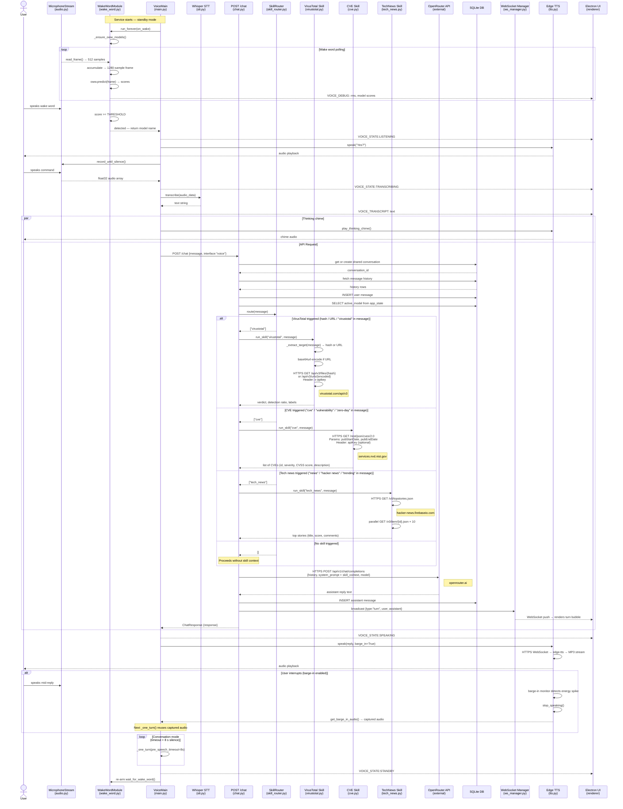

# Charles — Sequence Diagram

```mermaid
sequenceDiagram
    actor User
    participant Mic as MicrophoneStream<br>(audio.py)
    participant WW as WakeWordModule<br>(wake_word.py)
    participant Main as VoiceMain<br>(main.py)
    participant STT as Whisper STT<br>(stt.py)
    participant Chat as POST /chat<br>(chat.py)
    participant SR as SkillRouter<br>(skill_router.py)
    participant VT as VirusTotal Skill<br>(virustotal.py)
    participant CVE as CVE Skill<br>(cve.py)
    participant HN as TechNews Skill<br>(tech_news.py)
    participant OR as OpenRouter API<br>(external)
    participant DB as SQLite DB
    participant WS as WebSocket Manager<br>(ws_manager.py)
    participant TTS as Edge TTS<br>(tts.py)
    participant UI as Electron UI<br>(renderer)

    Note over Main,WW: Service starts — standby mode

    Main ->> WW: run_forever(on_wake)
    WW ->> WW: _ensure_oww_models()

    loop Wake word polling
        Mic -->> WW: read_frame() → 512 samples
        WW ->> WW: accumulate → 1280-sample frame
        WW ->> WW: oww.predict(frame) → scores
        WW -->> UI: VOICE_DEBUG: rms, model scores
    end

    User ->> Mic: speaks wake word
    WW ->> WW: score >= THRESHOLD
    WW -->> Main: detected — return model name
    Main -->> UI: VOICE_STATE:LISTENING
    Main ->> TTS: speak("Yes?")
    TTS -->> User: audio playback

    Main ->> Mic: record_until_silence()
    User ->> Mic: speaks command
    Mic -->> Main: float32 audio array
    Main -->> UI: VOICE_STATE:TRANSCRIBING

    Main ->> STT: transcribe(audio_data)
    STT -->> Main: text string
    Main -->> UI: VOICE_TRANSCRIPT: text

    par Thinking chime
        Main ->> TTS: play_thinking_chime()
        TTS -->> User: chime audio
    and API Request
        Main ->> Chat: POST /chat {message, interface:"voice"}

        Chat ->> DB: get or create shared conversation
        DB -->> Chat: conversation_id
        Chat ->> DB: fetch message history
        DB -->> Chat: history rows
        Chat ->> DB: INSERT user message
        Chat ->> DB: SELECT active_model from app_state

        Chat ->> SR: route(message)

        alt VirusTotal triggered (hash / URL / "virustotal" in message)
            SR -->> Chat: ["virustotal"]
            Chat ->> VT: run_skill("virustotal", message)
            VT ->> VT: _extract_target(message) → hash or URL
            VT ->> VT: base64url-encode if URL
            VT ->> VT: HTTPS GET /api/v3/files/{hash}<br>or /api/v3/urls/{encoded}<br>Header: x-apikey
            Note right of VT: virustotal.com/api/v3
            VT -->> Chat: verdict, detection ratio, labels
        else CVE triggered ("cve" / "vulnerability" / "zero-day" in message)
            SR -->> Chat: ["cve"]
            Chat ->> CVE: run_skill("cve", message)
            CVE ->> CVE: HTTPS GET /rest/json/cves/2.0<br>Params: pubStartDate, pubEndDate<br>Header: apiKey (optional)
            Note right of CVE: services.nvd.nist.gov
            CVE -->> Chat: list of CVEs (id, severity, CVSS score, description)
        else Tech news triggered ("news" / "hacker news" / "trending" in message)
            SR -->> Chat: ["tech_news"]
            Chat ->> HN: run_skill("tech_news", message)
            HN ->> HN: HTTPS GET /v0/topstories.json
            Note right of HN: hacker-news.firebaseio.com
            HN ->> HN: parallel GET /v0/item/{id}.json × 10
            HN -->> Chat: top stories (title, score, comments)
        else No skill triggered
            SR -->> Chat: []
            Note over Chat: Proceeds without skill context
        end

        Chat ->> OR: HTTPS POST /api/v1/chat/completions<br>{history, system_prompt + skill_context, model}
        Note right of OR: openrouter.ai
        OR -->> Chat: assistant reply text

        Chat ->> DB: INSERT assistant message
        Chat ->> WS: broadcast {type:"turn", user, assistant}
        WS -->> UI: WebSocket push → renders turn bubble
        Chat -->> Main: ChatResponse {response}
    end

    Main -->> UI: VOICE_STATE:SPEAKING
    Main ->> TTS: speak(reply, barge_in=True)
    TTS ->> TTS: HTTPS WebSocket → edge-tts → MP3 stream
    TTS -->> User: audio playback

    alt User interrupts (barge-in enabled)
        User ->> Mic: speaks mid-reply
        TTS ->> TTS: barge-in monitor detects energy spike
        TTS ->> TTS: stop_speaking()
        TTS -->> Main: get_barge_in_audio() → captured audio
        Note over Main: Next _one_turn() reuses captured audio
    end

    loop Conversation mode (timeout = 8 s silence)
        Main ->> Main: _one_turn(pre_speech_timeout=8s)
    end

    Main -->> UI: VOICE_STATE:STANDBY
    Main ->> WW: re-arm wait_for_wake_word()
```
