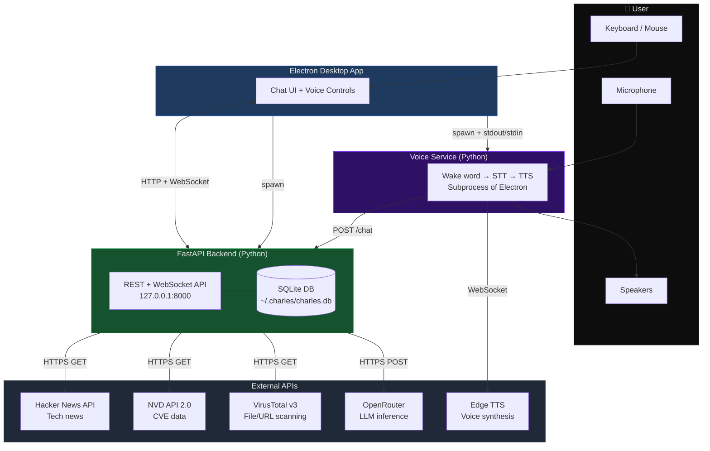

# Architecture Diagram 1 of 3 — System Overview (L1)

Three-process architecture with external API dependencies. No internal component detail — see arch_02 and arch_03 for drill-downs.

```mermaid
graph TB
    subgraph User["👤 User"]
        MIC["Microphone"]
        SPK["Speakers"]
        KBD["Keyboard / Mouse"]
    end

    subgraph Electron["Electron Desktop App"]
        UI["Chat UI + Voice Controls"]
    end

    subgraph Voice["Voice Service (Python)"]
        VS["Wake word → STT → TTS<br>Subprocess of Electron"]
    end

    subgraph API["FastAPI Backend (Python)"]
        BE["REST + WebSocket API<br>127.0.0.1:8000"]
        DB[("SQLite DB<br>~/.charles/charles.db")]
        BE --- DB
    end

    subgraph External["External APIs"]
        OR["OpenRouter<br>LLM inference"]
        VT["VirusTotal v3<br>File/URL scanning"]
        NVD["NVD API 2.0<br>CVE data"]
        HN["Hacker News API<br>Tech news"]
        ETSS["Edge TTS<br>Voice synthesis"]
    end

    MIC --> VS
    VS --> SPK
    KBD --> UI

    Electron -->|spawn + stdout/stdin| Voice
    Electron -->|spawn| API
    UI <-->|HTTP + WebSocket| API
    VS -->|POST /chat| API

    API -->|HTTPS POST| OR
    API -->|HTTPS GET| VT
    API -->|HTTPS GET| NVD
    API -->|HTTPS GET| HN
    VS -->|WebSocket| ETSS

    style Electron fill:#1e3a5f,stroke:#2563eb,color:#e8e8e8
    style Voice    fill:#2e1065,stroke:#7c3aed,color:#e8e8e8
    style API      fill:#14532d,stroke:#16a34a,color:#e8e8e8
    style External fill:#1f2937,stroke:#4b5563,color:#e8e8e8
    style User     fill:#0d0d0d,stroke:#374151,color:#e8e8e8
```
