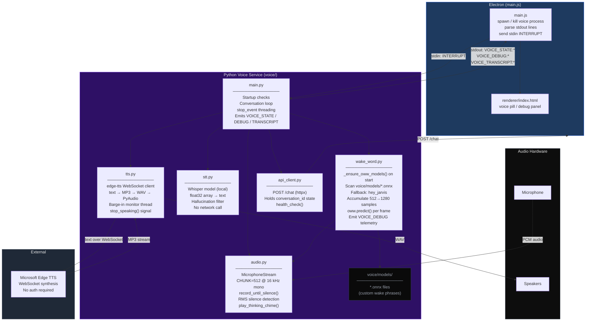

# Architecture Diagram 2 of 3 — Voice Service Internals

Internal component breakdown of the Python voice service and its connections to Electron and the Edge TTS external API.

```mermaid
graph TB
    subgraph Electron["Electron (main.js)"]
        MAIN["main.js<br>spawn / kill voice process<br>parse stdout lines<br>send stdin INTERRUPT"]
        UI["renderer/index.html<br>voice pill / debug panel"]
    end

    subgraph Hardware["Audio Hardware"]
        MIC["Microphone"]
        SPK["Speakers"]
    end

    subgraph VoiceService["Python Voice Service (voice/)"]
        VMAIN["main.py<br>────────────────<br>Startup checks<br>Conversation loop<br>stop_event threading<br>Emits VOICE_STATE / DEBUG / TRANSCRIPT"]

        WAKE["wake_word.py<br>────────────────<br>_ensure_oww_models() on start<br>Scan voice/models/*.onnx<br>Fallback: hey_jarvis<br>Accumulate 512→1280 samples<br>oww.predict() per frame<br>Emit VOICE_DEBUG telemetry"]

        AUDIO["audio.py<br>────────────────<br>MicrophoneStream<br>CHUNK=512 @ 16 kHz mono<br>record_until_silence()<br>RMS silence detection<br>play_thinking_chime()"]

        STT["stt.py<br>────────────────<br>Whisper model (local)<br>float32 array → text<br>Hallucination filter<br>No network call"]

        TTS["tts.py<br>────────────────<br>edge-tts WebSocket client<br>text → MP3 → WAV → PyAudio<br>Barge-in monitor thread<br>stop_speaking() signal"]

        APICLI["api_client.py<br>────────────────<br>POST /chat (httpx)<br>Holds conversation_id state<br>health_check()"]

        MODELS["voice/models/<br>────────────────<br>*.onnx files<br>(custom wake phrases)"]

        VMAIN --> WAKE
        VMAIN --> STT
        VMAIN --> TTS
        VMAIN --> APICLI
        VMAIN --> AUDIO
        WAKE --> AUDIO
        WAKE --> MODELS
    end

    subgraph ExtTTS["External"]
        EDGETSS["Microsoft Edge TTS<br>WebSocket synthesis<br>No auth required"]
    end

    MIC -->|PCM audio| AUDIO
    TTS -->|WAV| SPK
    TTS -->|text over WebSocket| EDGETSS
    EDGETSS -->|MP3 stream| TTS

    VMAIN -->|stdout: VOICE_STATE:*<br>VOICE_DEBUG:*<br>VOICE_TRANSCRIPT:*| MAIN
    MAIN -->|stdin: INTERRUPT| VMAIN
    MAIN --> UI
    APICLI -->|POST /chat| Electron

    style VoiceService fill:#2e1065,stroke:#7c3aed,color:#e8e8e8
    style Electron     fill:#1e3a5f,stroke:#2563eb,color:#e8e8e8
    style Hardware     fill:#0d0d0d,stroke:#374151,color:#e8e8e8
    style ExtTTS       fill:#1f2937,stroke:#4b5563,color:#e8e8e8
    style MODELS       fill:#0a0a0a,stroke:#374151,color:#9ca3af
```
