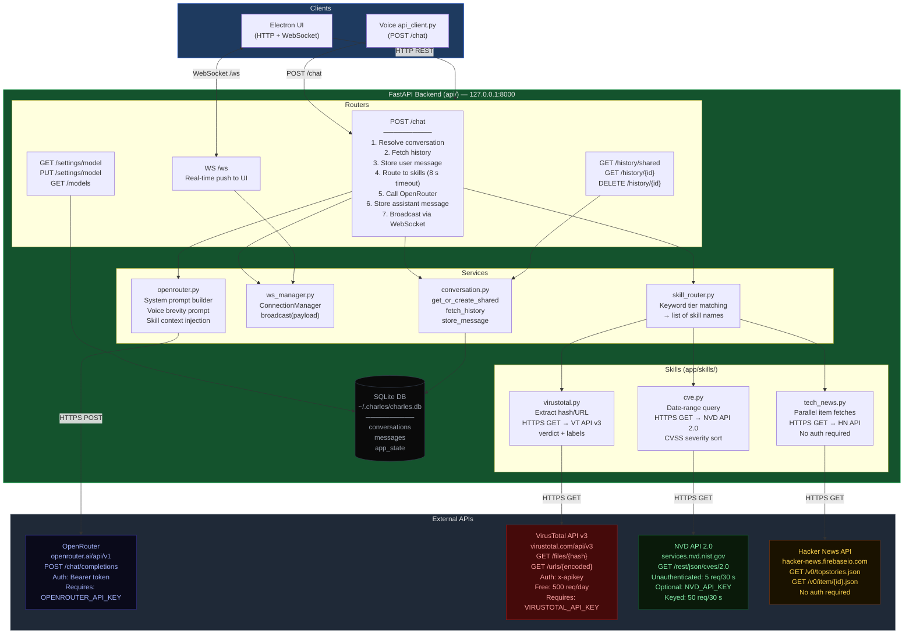

# Architecture Diagram 3 of 3 — API Service Internals

Internal component breakdown of the FastAPI backend, skill layer, database, and all external API connections.

```mermaid
graph TB
    subgraph Clients["Clients"]
        UI["Electron UI<br>(HTTP + WebSocket)"]
        VCLI["Voice api_client.py<br>(POST /chat)"]
    end

    subgraph APIService["FastAPI Backend (api/) — 127.0.0.1:8000"]
        direction TB

        subgraph Routers["Routers"]
            CHAT["POST /chat<br>──────────<br>1. Resolve conversation<br>2. Fetch history<br>3. Store user message<br>4. Route to skills (8 s timeout)<br>5. Call OpenRouter<br>6. Store assistant message<br>7. Broadcast via WebSocket"]
            HIST["GET /history/shared<br>GET /history/{id}<br>DELETE /history/{id}"]
            SET["GET /settings/model<br>PUT /settings/model<br>GET /models"]
            WS["WS /ws<br>Real-time push to UI"]
        end

        subgraph Services["Services"]
            CONV["conversation.py<br>get_or_create_shared<br>fetch_history<br>store_message"]
            WSMGR["ws_manager.py<br>ConnectionManager<br>broadcast(payload)"]
            SKILLR["skill_router.py<br>Keyword tier matching<br>→ list of skill names"]
            ORSERV["openrouter.py<br>System prompt builder<br>Voice brevity prompt<br>Skill context injection"]
        end

        subgraph Skills["Skills (app/skills/)"]
            SVTSKILL["virustotal.py<br>Extract hash/URL<br>HTTPS GET → VT API v3<br>verdict + labels"]
            SCVESKILL["cve.py<br>Date-range query<br>HTTPS GET → NVD API 2.0<br>CVSS severity sort"]
            SNEWSSKILL["tech_news.py<br>Parallel item fetches<br>HTTPS GET → HN API<br>No auth required"]
        end

        DB[("SQLite DB<br>~/.charles/charles.db<br>──────────<br>conversations<br>messages<br>app_state")]

        CHAT --> CONV
        CHAT --> SKILLR
        CHAT --> ORSERV
        CHAT --> WSMGR
        HIST --> CONV
        SET --> DB
        WS --> WSMGR
        SKILLR --> SVTSKILL
        SKILLR --> SCVESKILL
        SKILLR --> SNEWSSKILL
        CONV --> DB
    end

    subgraph External["External APIs"]
        OR["OpenRouter<br>openrouter.ai/api/v1<br>POST /chat/completions<br>Auth: Bearer token<br>Requires: OPENROUTER_API_KEY"]
        VTAPI["VirusTotal API v3<br>virustotal.com/api/v3<br>GET /files/{hash}<br>GET /urls/{encoded}<br>Auth: x-apikey<br>Free: 500 req/day<br>Requires: VIRUSTOTAL_API_KEY"]
        NVDAPI["NVD API 2.0<br>services.nvd.nist.gov<br>GET /rest/json/cves/2.0<br>Unauthenticated: 5 req/30 s<br>Optional: NVD_API_KEY<br>Keyed: 50 req/30 s"]
        HNAPI["Hacker News API<br>hacker-news.firebaseio.com<br>GET /v0/topstories.json<br>GET /v0/item/{id}.json<br>No auth required"]
    end

    UI -->|HTTP REST| Routers
    UI <-->|WebSocket /ws| WS
    VCLI -->|POST /chat| CHAT

    ORSERV -->|HTTPS POST| OR
    SVTSKILL -->|HTTPS GET| VTAPI
    SCVESKILL -->|HTTPS GET| NVDAPI
    SNEWSSKILL -->|HTTPS GET| HNAPI

    style APIService fill:#14532d,stroke:#16a34a,color:#e8e8e8
    style External   fill:#1f2937,stroke:#4b5563,color:#e8e8e8
    style Clients    fill:#1e3a5f,stroke:#2563eb,color:#e8e8e8
    style DB         fill:#0a0a0a,stroke:#374151,color:#9ca3af
    style VTAPI      fill:#450a0a,stroke:#991b1b,color:#fca5a5
    style NVDAPI     fill:#0a1a0a,stroke:#14532d,color:#86efac
    style HNAPI      fill:#1a1200,stroke:#78350f,color:#fcd34d
    style OR         fill:#0a0a1a,stroke:#312e81,color:#a5b4fc
```
