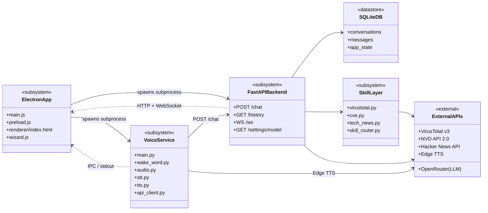

# Class Diagram 1 of 4 — System Overview (L1)

High-level view of the three major subsystems and their primary dependencies. Implementation detail is in class_02–04.

```mermaid
classDiagram
    direction LR

    class ElectronApp {
        <<subsystem>>
        +main.js
        +preload.js
        +renderer/index.html
        +wizard.js
    }

    class VoiceService {
        <<subsystem>>
        +main.py
        +wake_word.py
        +audio.py
        +stt.py
        +tts.py
        +api_client.py
    }

    class FastAPIBackend {
        <<subsystem>>
        +POST /chat
        +GET /history
        +WS /ws
        +GET /settings/model
    }

    class SQLiteDB {
        <<datastore>>
        +conversations
        +messages
        +app_state
    }

    class SkillLayer {
        <<subsystem>>
        +virustotal.py
        +cve.py
        +tech_news.py
        +skill_router.py
    }

    class ExternalAPIs {
        <<external>>
        +OpenRouter (LLM)
        +VirusTotal v3
        +NVD API 2.0
        +Hacker News API
        +Edge TTS
    }

    ElectronApp --> VoiceService : spawns subprocess
    ElectronApp --> FastAPIBackend : spawns subprocess
    ElectronApp <.. VoiceService : IPC / stdout
    ElectronApp <.. FastAPIBackend : HTTP + WebSocket

    VoiceService --> FastAPIBackend : POST /chat
    FastAPIBackend --> SQLiteDB
    FastAPIBackend --> SkillLayer
    SkillLayer --> ExternalAPIs
    FastAPIBackend --> ExternalAPIs
    VoiceService --> ExternalAPIs : Edge TTS
```
