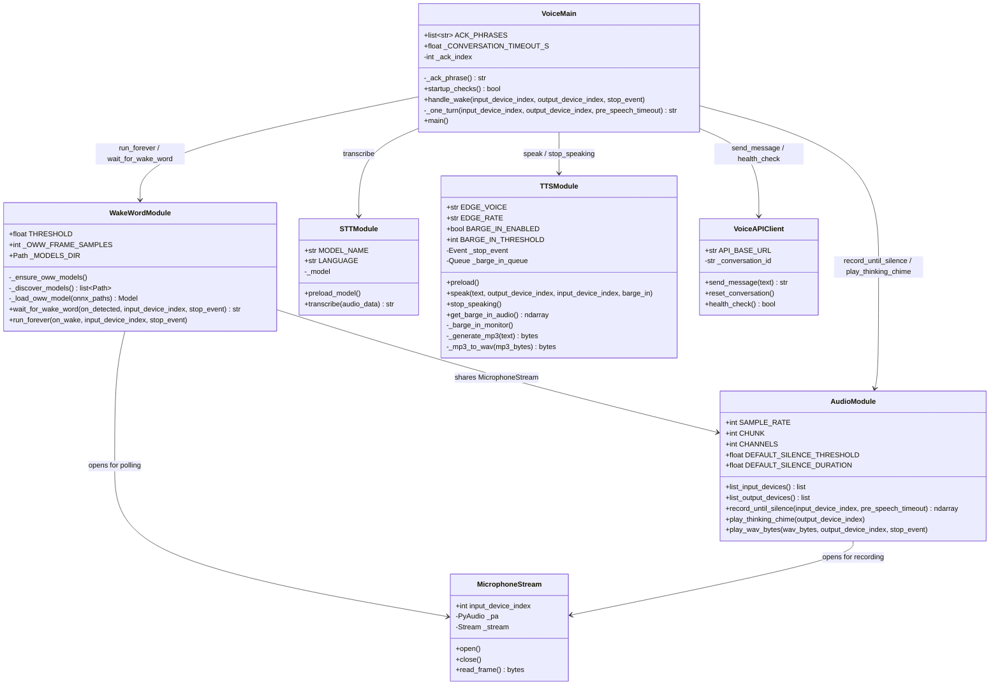

# Class Diagram 2 of 4 — Voice Service

Detailed classes for the Python voice service (voice/).

```mermaid
classDiagram
    direction TB

    class VoiceMain {
        +list~str~ ACK_PHRASES
        +float _CONVERSATION_TIMEOUT_S
        -int _ack_index
        -_ack_phrase() str
        +startup_checks() bool
        +handle_wake(input_device_index, output_device_index, stop_event)
        -_one_turn(input_device_index, output_device_index, pre_speech_timeout) str
        +main()
    }

    class WakeWordModule {
        +float THRESHOLD
        +int _OWW_FRAME_SAMPLES
        +Path _MODELS_DIR
        -_ensure_oww_models()
        -_discover_models() list~Path~
        -_load_oww_model(onnx_paths) Model
        +wait_for_wake_word(on_detected, input_device_index, stop_event) str
        +run_forever(on_wake, input_device_index, stop_event)
    }

    class AudioModule {
        +int SAMPLE_RATE
        +int CHUNK
        +int CHANNELS
        +float DEFAULT_SILENCE_THRESHOLD
        +float DEFAULT_SILENCE_DURATION
        +list_input_devices() list
        +list_output_devices() list
        +record_until_silence(input_device_index, pre_speech_timeout) ndarray
        +play_thinking_chime(output_device_index)
        +play_wav_bytes(wav_bytes, output_device_index, stop_event)
    }

    class MicrophoneStream {
        +int input_device_index
        -PyAudio _pa
        -Stream _stream
        +open()
        +close()
        +read_frame() bytes
    }

    class STTModule {
        +str MODEL_NAME
        +str LANGUAGE
        -_model
        +preload_model()
        +transcribe(audio_data) str
    }

    class TTSModule {
        +str EDGE_VOICE
        +str EDGE_RATE
        +bool BARGE_IN_ENABLED
        +int BARGE_IN_THRESHOLD
        -Event _stop_event
        -Queue _barge_in_queue
        +preload()
        +speak(text, output_device_index, input_device_index, barge_in)
        +stop_speaking()
        +get_barge_in_audio() ndarray
        -_barge_in_monitor()
        -_generate_mp3(text) bytes
        -_mp3_to_wav(mp3_bytes) bytes
    }

    class VoiceAPIClient {
        +str API_BASE_URL
        -str _conversation_id
        +send_message(text) str
        +reset_conversation()
        +health_check() bool
    }

    VoiceMain --> WakeWordModule : run_forever / wait_for_wake_word
    VoiceMain --> STTModule : transcribe
    VoiceMain --> TTSModule : speak / stop_speaking
    VoiceMain --> VoiceAPIClient : send_message / health_check
    VoiceMain --> AudioModule : record_until_silence / play_thinking_chime

    WakeWordModule --> MicrophoneStream : opens for polling
    WakeWordModule --> AudioModule : shares MicrophoneStream
    AudioModule --> MicrophoneStream : opens for recording
```
