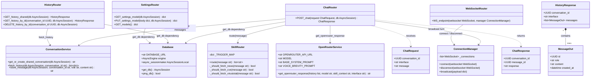

# Class Diagram 3 of 4 — API Service

Detailed classes for the FastAPI backend (api/), covering routers, services, models, and the database layer.

```mermaid
classDiagram
    direction TB

    class ChatRouter {
        +POST_chat(request ChatRequest, db AsyncSession) ChatResponse
    }

    class HistoryRouter {
        +GET_history_shared(db AsyncSession) HistoryResponse
        +GET_history_by_id(conversation_id UUID, db AsyncSession) HistoryResponse
        +DELETE_history_by_id(conversation_id UUID, db AsyncSession)
    }

    class SettingsRouter {
        +GET_settings_model(db AsyncSession) dict
        +PUT_settings_model(body dict, db AsyncSession) dict
        +GET_models() dict
    }

    class WebSocketRouter {
        +WS_endpoint(websocket WebSocket, manager ConnectionManager)
    }

    class ChatRequest {
        +UUID conversation_id
        +str interface
        +str message
    }

    class ChatResponse {
        +UUID conversation_id
        +UUID message_id
        +str response
    }

    class MessageOut {
        +UUID id
        +str role
        +str content
        +datetime created_at
    }

    class HistoryResponse {
        +UUID conversation_id
        +str interface
        +list~MessageOut~ messages
    }

    class ConversationService {
        +get_or_create_shared_conversation(db AsyncSession) str
        +fetch_history(db AsyncSession, conversation_id str) list~dict~
        +store_message(db AsyncSession, conversation_id str, role str, content str) str
    }

    class ConnectionManager {
        -list~WebSocket~ _connections
        +connect(websocket WebSocket)
        +disconnect(websocket WebSocket)
        +broadcast(payload dict)
    }

    class OpenRouterService {
        +str OPENROUTER_API_URL
        +str MODEL
        +str BASE_SYSTEM_PROMPT
        +str VOICE_BREVITY_PROMPT
        +get_openrouter_response(history list, model str, skill_context str, interface str) str
    }

    class SkillRouter {
        -dict _TRIGGER_MAP
        +route(message str) list~str~
        -_should_fetch_news(message str) bool
        -_should_fetch_cve(message str) bool
        -_should_fetch_virustotal(message str) bool
    }

    class Database {
        +str DATABASE_URL
        +AsyncEngine engine
        +async_sessionmaker AsyncSessionLocal
        +get_db() AsyncSession
        +ping_db() bool
    }

    ChatRouter --> ConversationService : resolve and store messages
    ChatRouter --> SkillRouter : route(message)
    ChatRouter --> OpenRouterService : get_openrouter_response
    ChatRouter --> ConnectionManager : broadcast turn
    ChatRouter --> Database : get_db dependency

    HistoryRouter --> ConversationService : fetch_history
    HistoryRouter --> Database : get_db dependency

    SettingsRouter --> Database : get_db dependency

    WebSocketRouter --> ConnectionManager : connect / disconnect

    HistoryResponse "1" *-- "many" MessageOut : contains

    ChatRouter ..> ChatRequest : receives
    ChatRouter ..> ChatResponse : returns
```
