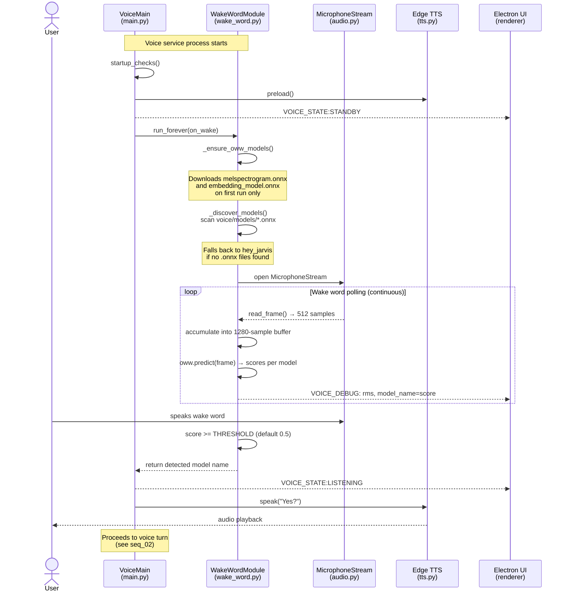

# Sequence Diagram 1 of 7 — Service Startup and Wake Word Detection

Covers: voice service startup, OWW model loading, the polling loop, and detection through to user acknowledgement.

```mermaid
sequenceDiagram
    actor User
    participant Main as VoiceMain<br>(main.py)
    participant WW as WakeWordModule<br>(wake_word.py)
    participant Mic as MicrophoneStream<br>(audio.py)
    participant TTS as Edge TTS<br>(tts.py)
    participant UI as Electron UI<br>(renderer)

    Note over Main,WW: Voice service process starts

    Main ->> Main: startup_checks()
    Main ->> TTS: preload()
    Main -->> UI: VOICE_STATE:STANDBY

    Main ->> WW: run_forever(on_wake)
    WW ->> WW: _ensure_oww_models()
    Note over WW: Downloads melspectrogram.onnx<br>and embedding_model.onnx<br>on first run only
    WW ->> WW: _discover_models()<br>scan voice/models/*.onnx
    Note over WW: Falls back to hey_jarvis<br>if no .onnx files found
    WW ->> Mic: open MicrophoneStream

    loop Wake word polling (continuous)
        Mic -->> WW: read_frame() → 512 samples
        WW ->> WW: accumulate into 1280-sample buffer
        WW ->> WW: oww.predict(frame) → scores per model
        WW -->> UI: VOICE_DEBUG: rms, model_name=score
    end

    User ->> Mic: speaks wake word
    WW ->> WW: score >= THRESHOLD (default 0.5)
    WW -->> Main: return detected model name
    Main -->> UI: VOICE_STATE:LISTENING

    Main ->> TTS: speak("Yes?")
    TTS -->> User: audio playback
    Note over Main: Proceeds to voice turn<br>(see seq_02)
```
