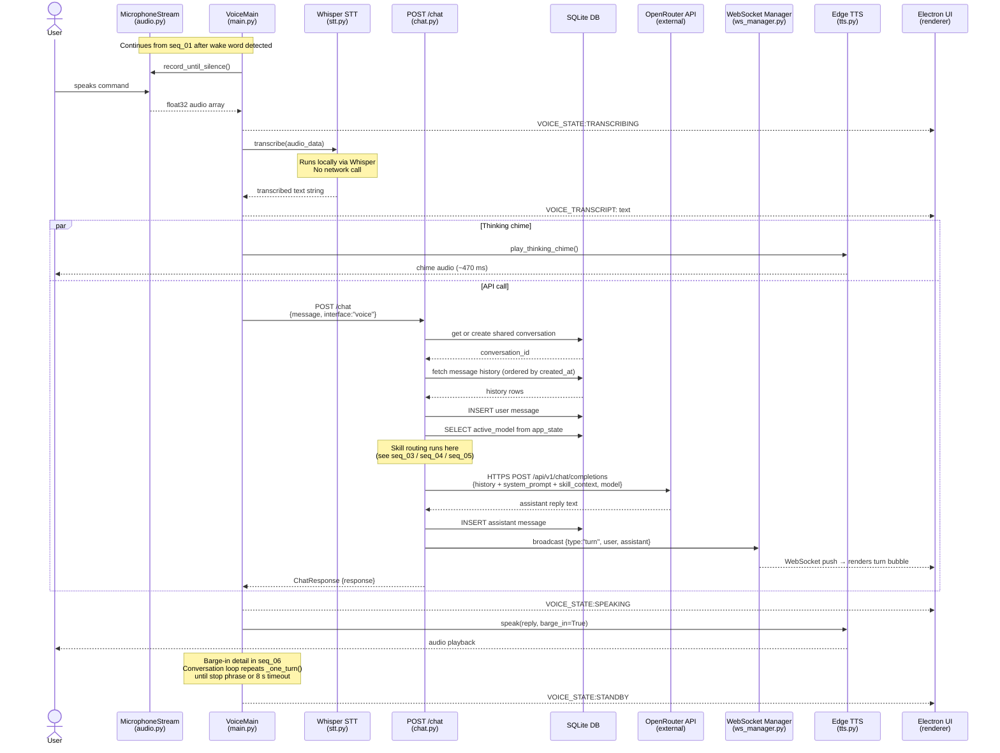

# Sequence Diagram 2 of 7 — Voice Turn (STT → API → TTS)

Covers: recording the user's speech, transcription, sending to the API, receiving a reply, and speaking it back. Skill routing detail is in seq_03–05.

