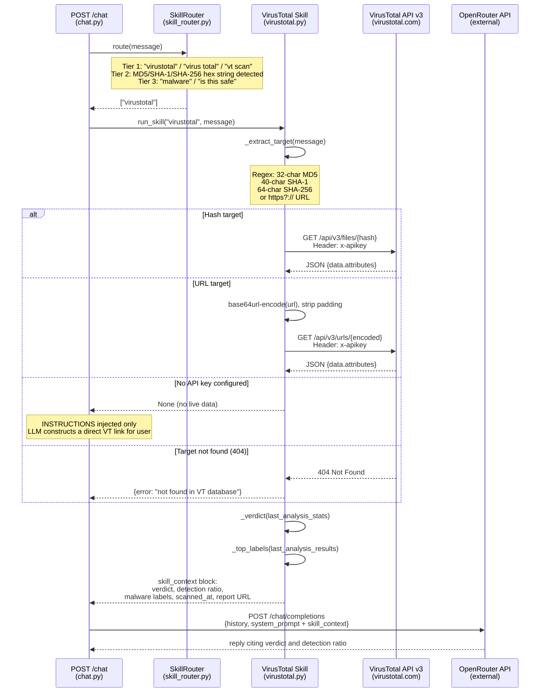

# Sequence Diagram 3 of 7 — Skill: VirusTotal

Covers: how the VirusTotal skill is triggered, what API call is made, and how the result is injected into the LLM context. Triggered when the user's message contains a file hash, URL, "virustotal", "malware", or "is this safe".

