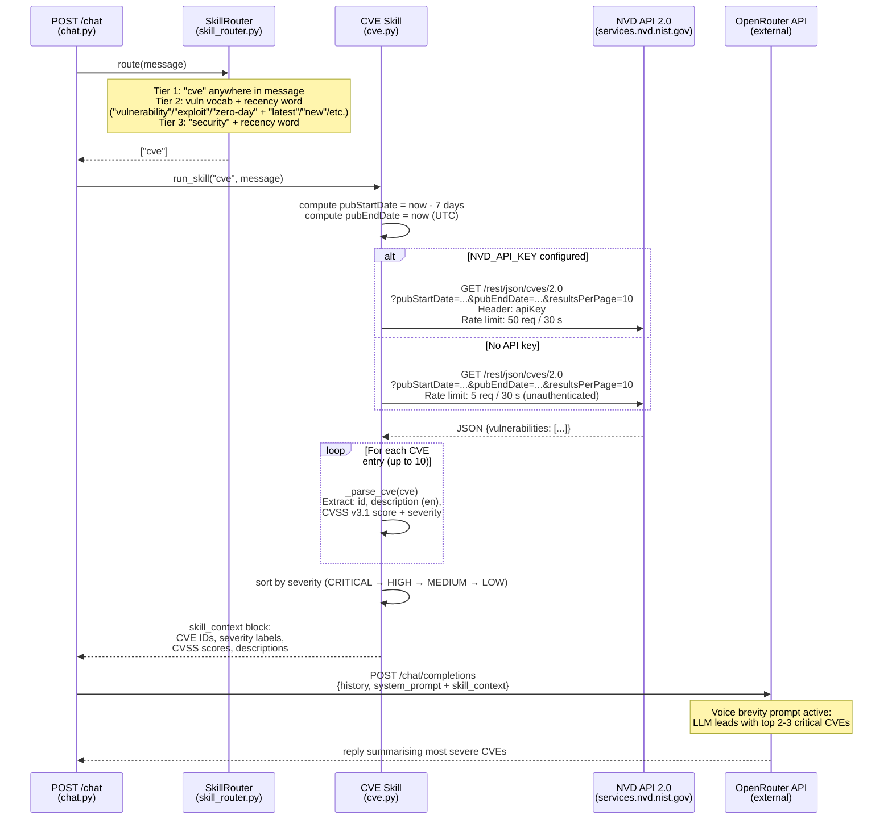

# Sequence Diagram 4 of 7 — Skill: CVE (NVD API)

Covers: how the CVE skill is triggered, the NVD API 2.0 query, parsing, and context injection. Triggered when the user's message contains "cve", "vulnerability", "exploit", "zero-day", "patch", or "security" with a recency signal.

