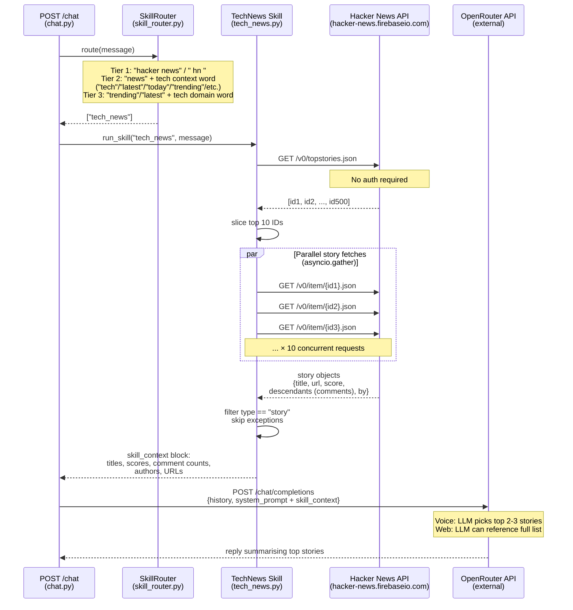

# Sequence Diagram 5 of 7 — Skill: Tech News (Hacker News)

Covers: how the tech news skill is triggered, the parallel Hacker News API calls, and context injection. Triggered when the user's message contains "hacker news", "news" with tech context words, or "trending" with tech context words.

