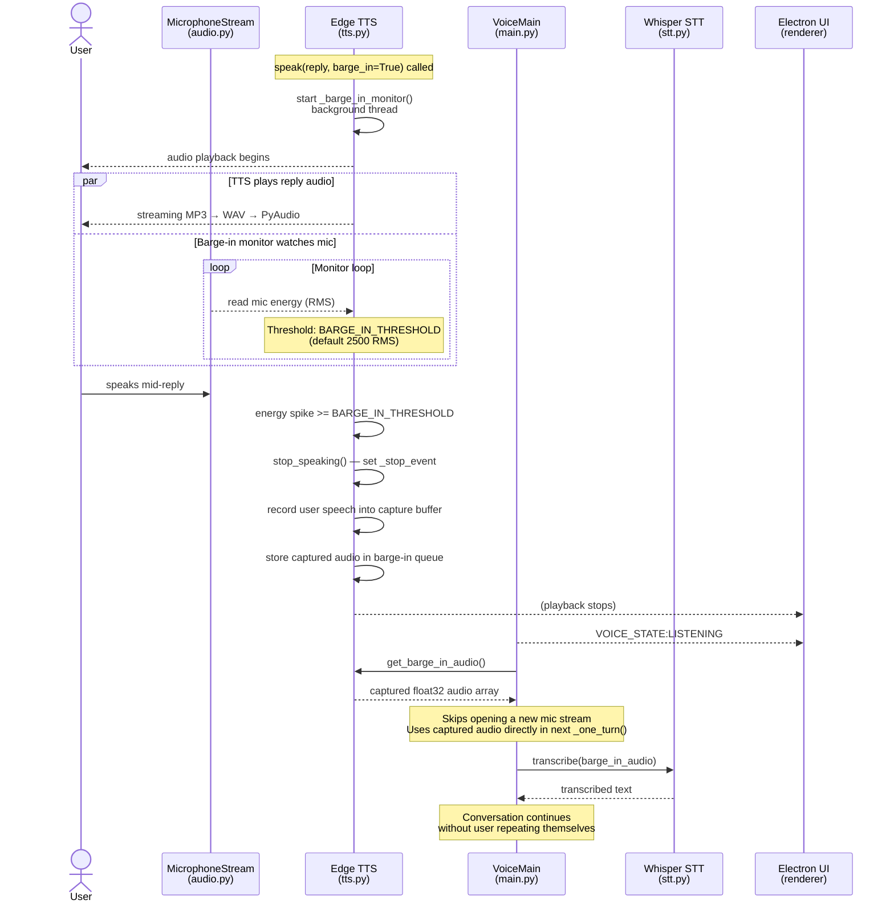

# Sequence Diagram 6 of 7 — Barge-In Interruption

Covers: the barge-in monitor that runs during TTS playback, how it captures user speech mid-reply, and how that audio is reused in the next turn. Only active when BARGE_IN_ENABLED=true in .env.

