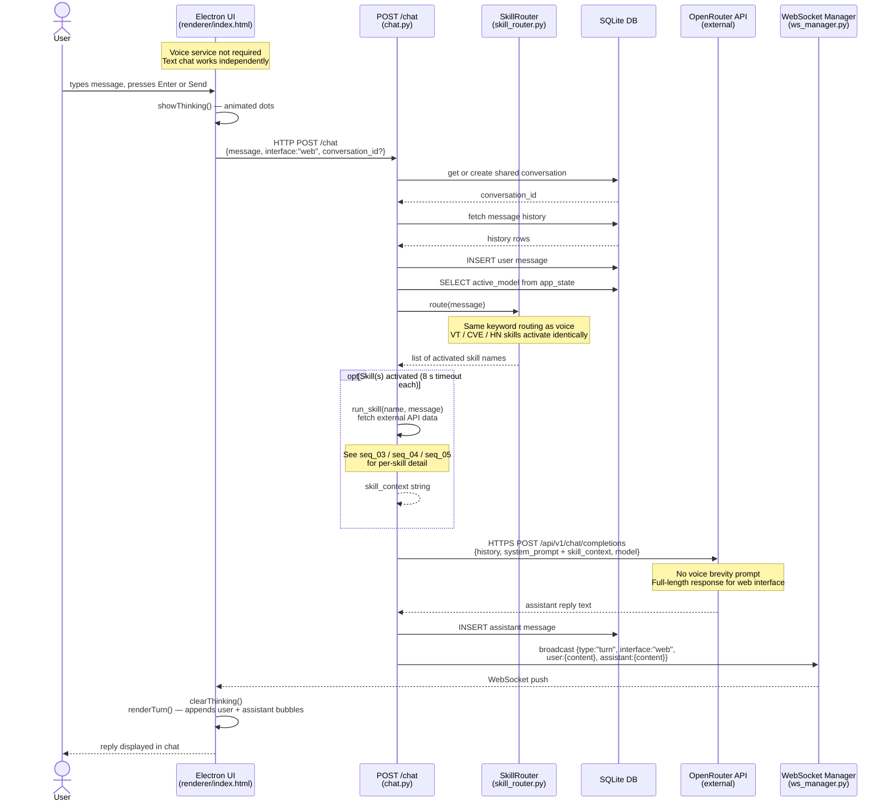

# Sequence Diagram 7 of 7 — Web Chat (Text Interface)

Covers: the text chat path from the Electron UI directly to the API, bypassing the voice service entirely. Skill routing and OpenRouter calls are identical to the voice path.

