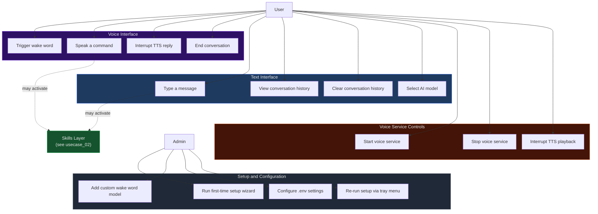

# Use Case Diagram 1 of 2 — User and Admin Overview

High-level use cases grouped by interface. Skill and external API detail is in usecase_02.

```mermaid
%%{init: {"flowchart": {"rankSpacing": 50, "nodeSpacing": 20}}}%%
graph TB
    U["User"]
    A["Admin"]

    subgraph Voice["Voice Interface"]
        V1["Trigger wake word"]
        V2["Speak a command"]
        V3["Interrupt TTS reply"]
        V4["End conversation"]
    end

    subgraph Text["Text Interface"]
        T1["Type a message"]
        T2["View conversation history"]
        T3["Clear conversation history"]
        T4["Select AI model"]
    end

    subgraph Controls["Voice Service Controls"]
        C1["Start voice service"]
        C2["Stop voice service"]
        C3["Interrupt TTS playback"]
    end

    subgraph Setup["Setup and Configuration"]
        S1["Run first-time setup wizard"]
        S2["Add custom wake word model"]
        S3["Configure .env settings"]
        S4["Re-run setup via tray menu"]
    end

    SKILLS["Skills Layer<br>(see usecase_02)"]

    U --> V1
    U --> V2
    U --> V3
    U --> V4
    U --> T1
    U --> T2
    U --> T3
    U --> T4
    U --> C1
    U --> C2
    U --> C3

    A --> S1
    A --> S2
    A --> S3
    A --> S4

    V2 -.->|may activate| SKILLS
    T1 -.->|may activate| SKILLS

    %% Hidden rank-forcing edges — stack subgraphs vertically
    Voice ~~~ Text
    Text ~~~ Controls
    Controls ~~~ Setup

    style Voice    fill:#2e1065,stroke:#7c3aed,color:#e8e8e8
    style Text     fill:#1e3a5f,stroke:#2563eb,color:#e8e8e8
    style Controls fill:#431407,stroke:#c2410c,color:#e8e8e8
    style Setup    fill:#1f2937,stroke:#4b5563,color:#e8e8e8
    style SKILLS   fill:#14532d,stroke:#16a34a,color:#e8e8e8
```
