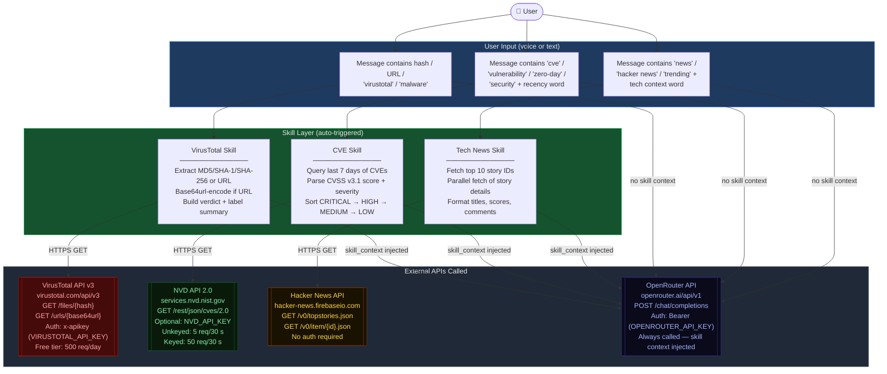

# Use Case Diagram 2 of 2 — Skills and External API Interactions

How user messages trigger the three skills and what external APIs are called as a result.

```mermaid
graph TB
    U(["👤 User"])

    subgraph Trigger["User Input (voice or text)"]
        I1["Message contains hash / URL /<br>'virustotal' / 'malware'"]
        I2["Message contains 'cve' /<br>'vulnerability' / 'zero-day' /<br>'security' + recency word"]
        I3["Message contains 'news' /<br>'hacker news' / 'trending' +<br>tech context word"]
    end

    subgraph Skills["Skill Layer (auto-triggered)"]
        SK1["VirusTotal Skill<br>──────────────<br>Extract MD5/SHA-1/SHA-256 or URL<br>Base64url-encode if URL<br>Build verdict + label summary"]
        SK2["CVE Skill<br>──────────────<br>Query last 7 days of CVEs<br>Parse CVSS v3.1 score + severity<br>Sort CRITICAL → HIGH → MEDIUM → LOW"]
        SK3["Tech News Skill<br>──────────────<br>Fetch top 10 story IDs<br>Parallel fetch of story details<br>Format titles, scores, comments"]
    end

    subgraph ExtAPIs["External APIs Called"]
        E1[["VirusTotal API v3<br>virustotal.com/api/v3<br>GET /files/{hash}<br>GET /urls/{base64url}<br>Auth: x-apikey (VIRUSTOTAL_API_KEY)<br>Free tier: 500 req/day"]]
        E2[["NVD API 2.0<br>services.nvd.nist.gov<br>GET /rest/json/cves/2.0<br>Optional: NVD_API_KEY<br>Unkeyed: 5 req/30 s<br>Keyed: 50 req/30 s"]]
        E3[["Hacker News API<br>hacker-news.firebaseio.com<br>GET /v0/topstories.json<br>GET /v0/item/{id}.json<br>No auth required"]]
        E4[["OpenRouter API<br>openrouter.ai/api/v1<br>POST /chat/completions<br>Auth: Bearer (OPENROUTER_API_KEY)<br>Always called — skill context injected"]]
    end

    U --> I1
    U --> I2
    U --> I3

    I1 --> SK1
    I2 --> SK2
    I3 --> SK3

    SK1 -->|HTTPS GET| E1
    SK2 -->|HTTPS GET| E2
    SK3 -->|HTTPS GET| E3

    SK1 -->|skill_context injected| E4
    SK2 -->|skill_context injected| E4
    SK3 -->|skill_context injected| E4
    I1 -->|no skill context| E4
    I2 -->|no skill context| E4
    I3 -->|no skill context| E4

    style Trigger   fill:#1e3a5f,stroke:#2563eb,color:#e8e8e8
    style Skills    fill:#14532d,stroke:#16a34a,color:#e8e8e8
    style ExtAPIs   fill:#1f2937,stroke:#4b5563,color:#e8e8e8
    style E1        fill:#450a0a,stroke:#991b1b,color:#fca5a5
    style E2        fill:#0a1a0a,stroke:#14532d,color:#86efac
    style E3        fill:#1a1200,stroke:#78350f,color:#fcd34d
    style E4        fill:#0a0a1a,stroke:#312e81,color:#a5b4fc
```
